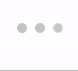

# Eluvio Components

## Action.js

Component that can be set to button or link that produces an action when clicked.

| name     | type   | attributes |  default |  description    |
| -------- | ------ |   ------   |  ------  | --------------- |
| type     |   string     |            |    button      | Specifies wether the component acts as a button or link                 |
| label    |   string     |            |          |   Sets text for component's aria-label              |
| title    |   string     |            |          |   Tooltip title text when hovering over component             |
| to       |   string     |            |          |   Sets path when component is used as link type              |
| onClick  |   function     |            |          |  Callback function for click event               |
| className|   string     |            |          |   Component's class name identifier             |
| children |   string, object or array     |   required   |          |   Content inside HTML element           |
| disabled |   boolean     |            |  false   |  Disables button functionality               |
| hidden   |   boolean     |            |  false   |  Hides components from view               |
| additionalProps |        |            |          |  Additional component properties for further customization               |

## AnimatedIcon.js

Three different animated icons that can be used for loading display. 

 - BallClipRotate   
 

 - BallPulse   
 

 - BallSpin
 

## AsyncComponent.js

Renders children in an asynchronous manner.

| name     | type   | attributes |  default |  description    |
| -------- | ------ |   ------   |  ------  | --------------- |
| load     |   function     |   required    |          |  Load function for asynchronous component        |
| render   |   function     |            |          |  Specifies how and when components will be rendered               |
| children |   node         |            |          |  Content rendered            |

## Balance.js

Displays wallet balance alongside ELV token icon. 

| name     | type   | attributes |  default |  description    |
| -------- | ------ |   ------   |  ------  | --------------- |
| balance  |   number     |            |        | Eluvio wallet balance    |
| className|   string     |            |          |   Component's class name identifier    |

## BrowseWidget.js

File browser component for both local and remote directories. 

| name     | type   | attributes |  default |  description    |
| -------- | ------ |   ------   |  ------  | --------------- |
| name     |  string     |            |          |  Specifies the name of input element               |
| onChange    |  function      |   required         |          |  Callback function for event handling               |
| required    |  boolean      |            |          | Specifies wether inpput field must be filled out or not                |
| multiple    |  boolean      |            |          | Allows user to enter more than one value in an input                |
| accept   |   string or strings array     |            |          | Specifies file types accepted by input                |
| preview    |  boolean      |            |          |   Allows a file preview image to be displayed               |
| hideFileList    |  boolean      |            |  false        | Hides list of files from directory                |
| directories    |  boolean      |            |          |  Specifies wether file directories are displaying or not               |
| progress    |   object    |            |          |                 |
| header    |  string      |            |          |  Header of file browser component               |
| remote    |  boolean      |            |          |  Allows to browse through remote files instead of local               |
| fileMetadata    |  object      |            |          |  Object containing files to be displayed                |
| mimeTypes    |  object      |            |          |  Acceptable media types by file browser component               |
| baseFileUrl    |  string      |            |          |  URL of preview display for file browser component               |
| extensions    |  strings array   |            |          |                 |

## Confirm.js

Modal element which prompts user to confirm or deny a specific function. 

| name     | type   | attributes |  default |  description    |
| -------- | ------ |   ------   |  ------  | --------------- |
| onConfirm     |   function     |          |          |   Callback function handling confirm trigger event              |
| onCancel   |   function     |            |          |  Callback function handling cancel trigger event                |
| message |   string or node         |  required         |          |  Text alert visible inside modal               |
| additionalInputs |   array         |           |          |  Additional input elements           |

## Copy.js

Clickable component that allows text to be copied to clipboard by simply clicking on it. Text is passed using the children prop. 

## EditableField.js

Editable text field component used to add and save textual information.

| name     | type   | attributes |  default |  description    |
| -------- | ------ |   ------   |  ------  | --------------- |
| children     |   element    |            |          |  HTML element where text will be contained after being submitted               |
| type    |   string     |            |  input        |   Editable field type. Can be set to textarea              |
| value    |   string or number    |            |          |  Specifies value of editable field               |
| truncate       |   boolean     |            |          |  Specifies wether editable field is truncated or not               |
| lines       |   number     |            |          |   Number of lines conserved until it gets truncated              |
| onChange       |   function     |    required        |          |  Callback function handling change trigger event               |
| className       |   string     |            |          |  Component's class name identifier before editing text field               |
| editClassName   |   string     |            |          |  Component's class name identifier while editing text field                |

## ErrorHandler.js

Error handling function that accepts a component and returns an error message is component is not set up accordingly or fed the right props. 

## FileBrowser.js

Directory of files where user can browse and preview data in table format. 

| name     | type   | attributes |  default |  description    |
| -------- | ------ |   ------   |  ------  | --------------- |
| header     |   string     |            |          |   Header of component              |
| baseFileUrl    |   string     |    required        |          |   URL of preview icon display          |
| extensions    |   strings array     |            |          |                 |
| files       |   object     |   required         |          |   Files to be displayed in directory              |
| mimeTypes      |   object     |           |          |   Acceptable media types              |
| Submit       |   function     |   required         |          |  Callback function handling submit trigger event               |
| Cancel       |   function     |   required         |          |  Callback function handling cancel trigger event                 |

## Form.js

Form component with different fillable fields to retrieve user input. 

| name     | type   | attributes |  default |  description    |
| -------- | ------ |   ------   |  ------  | --------------- |
| children     |   node     |            |          |  Types of input elements inside form's fieldset               |
| formContent    |   node     |            |          | Types of input elements inside form's fieldset              |
| legend    |   string     |            |          |  Form's legend              |
| redirectPath       |   string     |            |          | Path to new redirect location after mounting               |
| cancelPath       |   string     |            |          | Path to new redirect location when clicking cancel button                |
| submitText       |   string     |            |   Submit       | Text inside submit button                |
| cancelText       |   string     |            |   Cancel       | Text inside cancel button                |
| OnSubmit       |   function     |  required          |          |  Callback function handling submit trigger event               |
| OnCancel       |   function     |            |          |  Callback function handling cancel trigger event               |
| OnComplete       |   function     |            |          |  Callback function handling complete trigger event               |
| OnError       |   function     |            |          |  Callback function handling error display               |
| className       |   string     |            |          |  Component's class name identifier               |

## Icons.js

Different ways to display media icons with different functionalities. 

### CroppedIcon

Icon with specific dimensions. 

| name     | type   | attributes |  default |  description    |
| -------- | ------ |   ------   |  ------  | --------------- |
| icon     |   media     |   required    |          | Media icon to be displayed        |
| alternateIcon   |   media     |            |          |  Secondary media icon displayed in case of error               |
| label |   string         |            |          | Specifies alt attribute of img element             |
| className |   string         |            |          | Component's class name identifier of div container             |
| iconClassName |   string         |            |          |  Component's class name identifier of img element            |
| useLoadingIndicator |   boolean         |            |   false       |   Specifies wether loading element will display during loading state           |

### CroppedIconWithAction

Icon with specific dimensions with clickable elements.

| name     | type   | attributes |  default |  description    |
| -------- | ------ |   ------   |  ------  | --------------- |
| icon     |   media     |   required    |          | Media icon to be displayed        |
| alternateIcon   |   media     |            |          |  Secondary media icon displayed in case of error               |
| label |   string         |            |          | Specifies alt attribute of img element             |
| actionTest |   string         |            |          | Descriptive text for action element              |
| onClick |   function         |            |          | Callback function handling cancel trigger event              |
| children |   node         |            |          | Content displayed inside div element              |
| className |   string         |            |          | Component's class name identifier of div container             |
| iconClassName |   string         |            |          |  Component's class name identifier of img element            |
| useLoadingIndicator |   boolean         |            |   false       |   Specifies wether loading element will display during loading state           |

### ImageIcon

`img` element. 

| name     | type   | attributes |  default |  description    |
| -------- | ------ |   ------   |  ------  | --------------- |
| icon     |   media     |   required    |          | Media icon to be displayed        |
| alternateIcon   |   media     |            |          |  Secondary media icon displayed in case of error               |
| label |   string         |            |          | Specifies alt attribute of img element             |
| className |   string         |            |          | Component's class name identifier of div container             |
| useLoadingIndicator |   boolean         |            |   false       |   Specifies wether loading element will display during loading state           |

### IconButton

Icon that acts as clickable button.

| name     | type   | attributes |  default |  description    |
| -------- | ------ |   ------   |  ------  | --------------- |
| icon     |   media     |   required    |          | Media icon to be displayed        |
| label |   string         |            |          | Specifies aria-label attribute of button element             |
| title |   string         |            |          | Button's title attribute             |
| onClick |   function         |            |          | Callback function handling cancel trigger event              |
| className |   string         |            |          | Component's class name identifier            |
| disabled |   boolean         |            |  false        | Specifies button's disabled attribute            |
| hidden |   boolean         |            |  false        | Specifies wether element displays or not            |

### IconLink

Icon that acts as a link. 

| name     | type   | attributes |  default |  description    |
| -------- | ------ |   ------   |  ------  | --------------- |
| icon     |   media     |   required    |          | Media icon to be displayed        |
| label |   string         |            |          | Specifies aria-label attribute of button element             |
| href |   string         |            |          | Specifies the link's destination (HTML)           |
| to |   string         |            |          | Specifies the link's destination (React)           |
| className |   string         |            |          | Component's class name identifier            |

## Inputs.js

### FormatName
### Maybe
### Warning
### Input
### ColorSelection
### Checkbox
### TextArea
### Selection
### MultiSelect
### DateSelection
### ToggleSection
### LabelledField

## JsonInput.js

Text field that accepts json data.

| name     | type   | attributes |  default |  description    |
| -------- | ------ |   ------   |  ------  | --------------- |
| name     |   string     |   required         |          |  Specifies name of textarea element               |
| value    |   string     |            |          |  Specifies the value of textarea element               |
| onChange    |   function     |   required         |          |  Callback function handling change trigger event               |
| className       |   string     |            |          |  Component's class name identifier          |

## LoadingElement.js

Component used while waiting for data to be rendered.

| name     | type   | attributes |  default |  description    |
| -------- | ------ |   ------   |  ------  | --------------- |
| fullPage     |   boolean     |            |          |   Set loading state as full page display              |
| loading    |   boolean     |            |          | Specifies loading state (can also be set by observing a request)                |
| render    |   function     |            |          | Function that renders element(s)                |
| children       |   element or elements array     |            |          |   Elements displayed after loading state              |
| noIndicator       |   boolean     |            |          |  Specifies wether loading animation will display or not               |
| loadingClassname       |   string     |            |          |  Component's class name identifier for loading state               |

## Modal.js

Modal component.

| name     | type   | attributes |  default |  description    |
| -------- | ------ |   ------   |  ------  | --------------- |
| children     |   node     |            |          |   Content displayed inside modal component              |
| modalContent    |   node     |            |          |  Content displayed inside modal component               |
| OnClickOutside    |   function     |            |          | Callback function handling click trigger event outside modal container              |
| closable       |   boolean     |            |          |  Prevents closing of modal               |
| errorMessage       |   string     |            |          |  Error text alert inside modal               |
| className       |   string     |            |          | Component's class name identifier                |

## PreviewIcon.js

Preview component of an image icon with magnified tooltip. 

| name     | type   | attributes |  default |  description    |
| -------- | ------ |   ------   |  ------  | --------------- |
| fullUrl     |   string     |            |          |                 |
| baseFileUrl    |   string     |  required     |          |                 |
| imagePath    |   string     |  required    |          |                 |
| onHover       |   function     |            |          |  Callback function handling hover trigger event               |
| additionalContent   |   element     |            |          |  Additional content displayed inside tooltip               |
| icon       |  string     |            |          |  Media icon for background image              |

## RadioSelect.js

Radio selection component.

| name     | type   | attributes |  default |  description    |
| -------- | ------ |   ------   |  ------  | --------------- |
| name     |   string     |   required         |          |   Unique key name of div element              |
| inline    |   boolean     |            |          |  Display options as inline elements               |
| options    |   array of strings, numbers or booleans     |  required   |          |  Different options available for radio selection         |
| selected       |   string, number or boolean     |            |          |                 |
| required       |   boolean     |            |          |                 |
| onChange       |   function     |   required    |          |  Callback function handling change trigger event               |

## Slider.js

Slider component with a specified range of values. 

| name     | type   | attributes |  default |  description    |
| -------- | ------ |   ------   |  ------  | --------------- |
| min     |   number     |  required          |          |  Minimum range value               |
| max    |   number     |  required          |          |   Maximum range value              |
| showMarks    |   boolean     |            |  false        |   Displays interval marks              |
| marks       |   number     |            |          |  Specifies amount of interval marks displayed               |
| markTextEvery       |   number     |            |          |                 |
| topMarks       |   boolean     |            |          |                 |
| onChange       |   function     |            |          |  Callback function handling change trigger event               |
| renderToolTip     |   function     |            |          |  Function which renders slider tooltip        |
| handleStyle       |   string     |            |          | Specifies style of slider handle                |
| handleControlOnly       |   boolean     |            |          |                 |
| handles       |   objects array     |   required         |          |                 |
| value       |   number     |   required    |          |                 |
| handleClassName   |   string     |        |          | Slider class name identifier         |

## Tabs.js

List of tabs component. 

| name     | type   | attributes |  default |  description    |
| -------- | ------ |   ------   |  ------  | --------------- |
| options     |   array of strings, booleans or numbers     |    required        |          |  Different types of options displayed as tabs               |
| selected    |   string, boolean or number     |            |          |  Specifies styling of selection made by user               |
| onChange    |   function     |   required         |          |   Callback function handling change trigger event              |
| className       |   string     |            |          |  Component's class name identifier of container               |
| tabClassName    |   string     |            |          |  Component's class name identifier of single tab               |

## Tooltip.js

Tooltip component that can only be rendered as a child component. 

| name     | type   | attributes |  default |  description    |
| -------- | ------ |   ------   |  ------  | --------------- |
| className     |   string     |            |          |   Component's class name identifier              |
| content    |   string or node    |            |          | Content displayed inside tooltip                |
| children    |   node     |  required          |          | Content displayed inside tooltip                 |
| OnMouseEnter       |   function     |            |          | Callback function handling mouse trigger event                |
| OnMouseLeave       |   function     |            |          | Callback function handling mouse trigger event                |
| OnMouseMove        |   function     |            |          | Callback function handling mouse trigger event               |

## TraversableJson.js

Component that accepts data and renders it as json. 

| name     | type   | attributes |  default |  description    |
| -------- | ------ |   ------   |  ------  | --------------- |
| json     |   object, array, string, boolean or number     |            |          |  User input data               |
| editable    |   boolean     |            |   false       |   Specifies wether component can be edited or not              |
| onChange    |   function     |            |          |  Callback function handling change trigger event              |
| onDelete    |   function     |            |          |  Callback function handling delete trigger event               |
| deleteMessage    |   string     |            |          | Alert message after deletion                |

